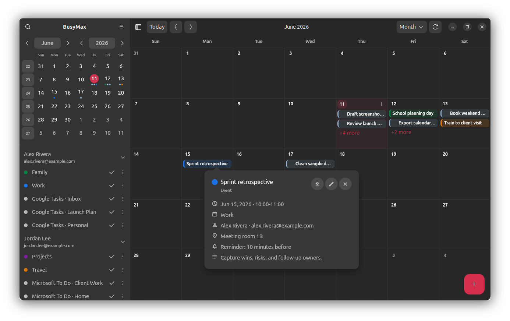
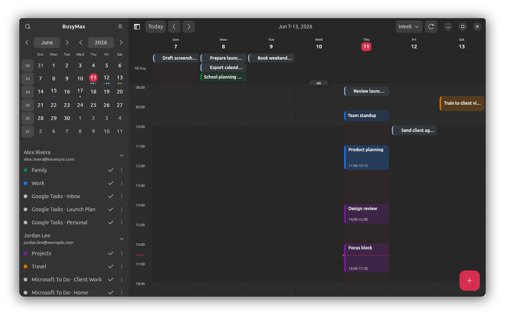
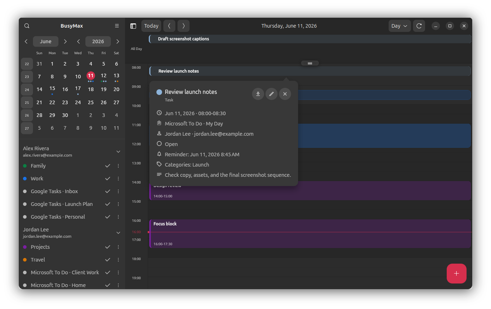
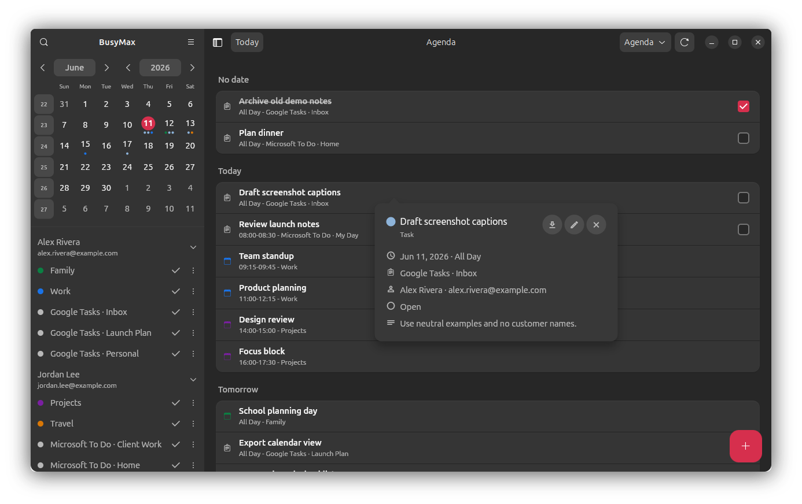
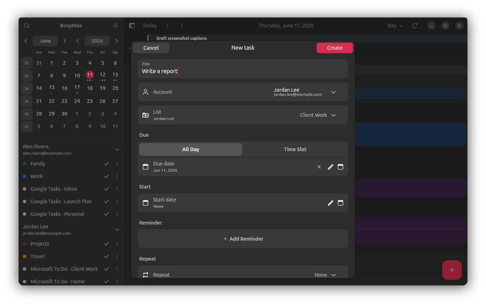
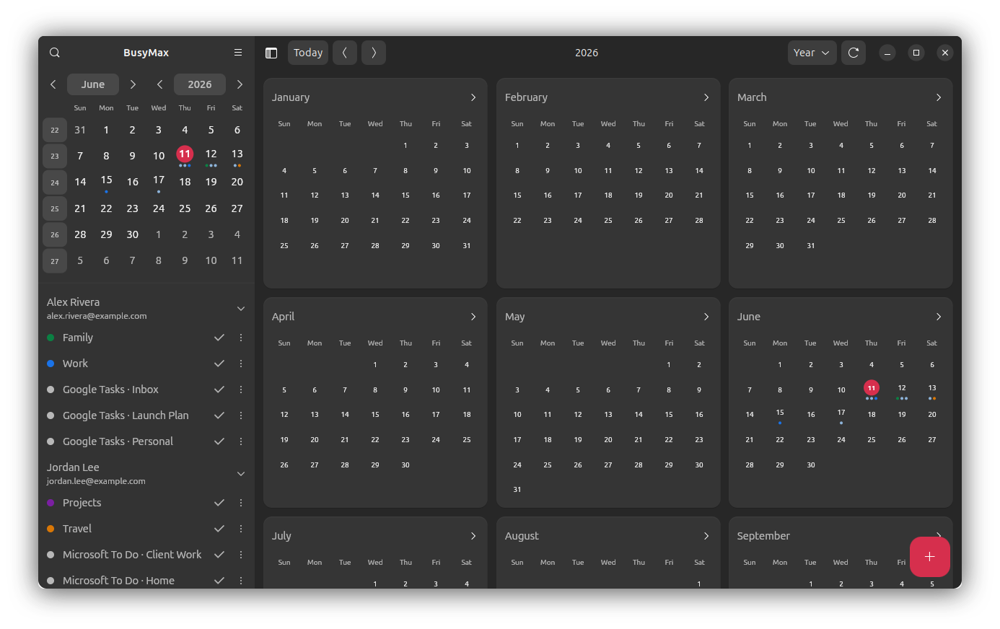
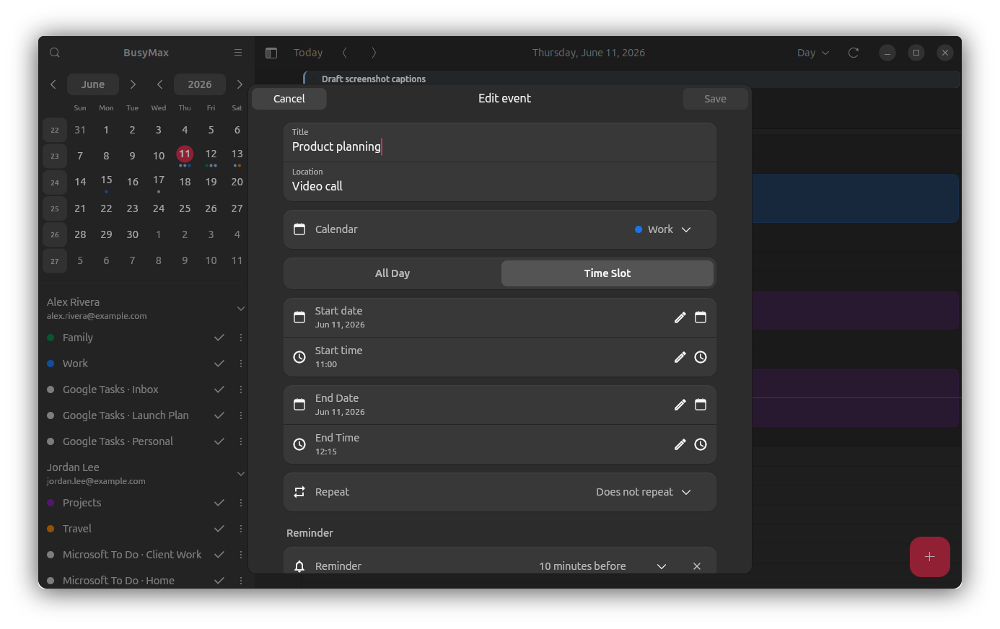
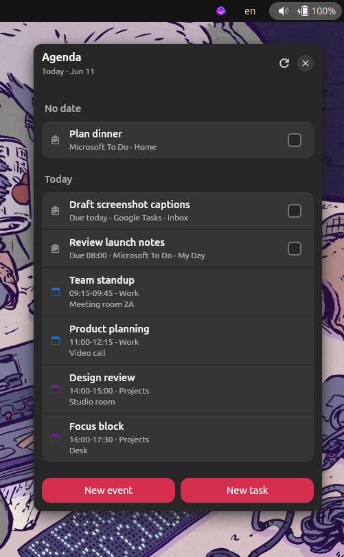
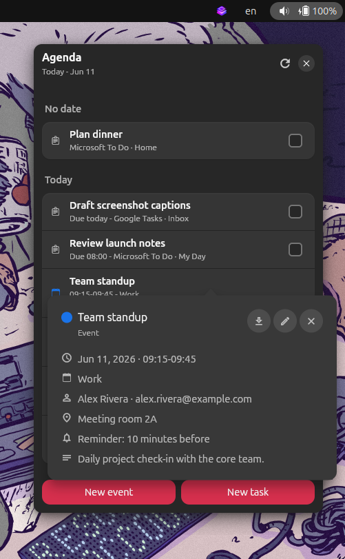
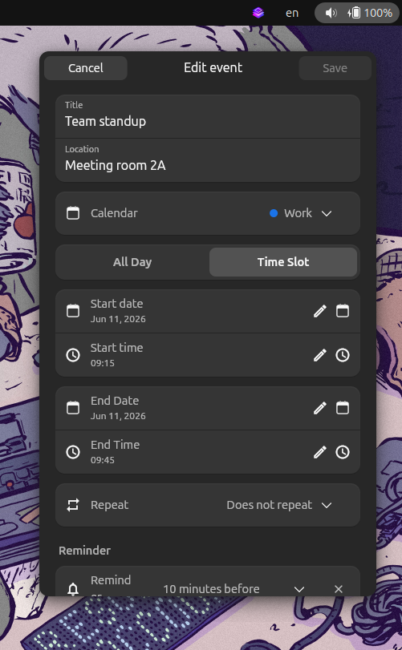

# BusyMax

BusyMax is a Linux desktop calendar and task manager built with Flutter.

It brings calendar events and tasks into a native-feeling Linux desktop interface, with support for `Google Calendar`, `Google Tasks`, `Microsoft Calendar`, and `Microsoft To Do`.

[](https://snapcraft.io/busymax)

[](https://snapcraft.io/busymax)

<p align="center">
  
</p>

<p align="center">
  <sub>Month view with calendars, tasks, and event details.</sub>
</p>

## Highlights

- Linux desktop app built with Flutter.
- Calendar views for day, week, month, year, and agenda planning.
- Task creation with lists, due dates, reminders, and repeat options.
- Event editing with calendar selection, time controls, repeat rules, and reminders.
- Compact agenda window for quick access to upcoming work.
- Integrations with Google Calendar, Google Tasks, Microsoft Calendar, and Microsoft To Do.

## Screenshots

<table>
  <tr>
    <td width="50%">
      
      <br>
      <sub><b>Week view</b> with color-coded calendars and scheduled tasks.</sub>
    </td>
    <td width="50%">
      
      <br>
      <sub><b>Day view</b> for focused daily planning.</sub>
    </td>
  </tr>
  <tr>
    <td width="50%">
      
      <br>
      <sub><b>Agenda view</b> with upcoming events, tasks, and details.</sub>
    </td>
    <td width="50%">
      
      <br>
      <sub><b>Task creation</b> with lists, due dates, reminders, and repeat options.</sub>
    </td>
  </tr>
</table>

<details>
<summary>More screenshots</summary>

<br>

<p>
  
</p>

<p>
  
</p>

<p>
  
  
  
</p>

</details>

## Prerequisites

- Flutter: https://docs.flutter.dev/install
- GTK 3 and libhandy development packages (`libgtk-3-dev` and
  `libhandy-1-dev` on Ubuntu/Debian)
- `GOOGLE_OAUTH_CLIENT_ID` and `GOOGLE_OAUTH_CLIENT_SECRET`, see [Google Setup](docs/google_setup.md)
- `MICROSOFT_OAUTH_CLIENT_ID`, see [Microsoft Setup](docs/microsoft_setup.md)

## Run locally

```bash
flutter run -d linux \
  --dart-define=GOOGLE_OAUTH_CLIENT_ID=<google-client-id> \
  --dart-define=GOOGLE_OAUTH_CLIENT_SECRET=<google-secret-if-needed> \
  --dart-define=MICROSOFT_OAUTH_CLIENT_ID=<microsoft-client-id>
```

## Feedback submissions

The native **Send feedback** form in the About dialog sends JSON to
`POST https://busystack.org/api/feedback`. Every submission contains a new
submission UUID, the application identifier `busymax`, the application version
and build number, the `linux` platform identifier, category, subject, message,
and optional reply email. A successful response has this form:

```json
{ "id": "server-reference-id" }
```

The optional technical-details checkbox is off by default. When the user
explicitly enables it, BusyMax adds only the Linux operating-system version and
application locale. BusyMax does not attach logs, account or calendar data,
file names, screenshots, environment variables, or other diagnostics.

For local website development, override the endpoint through the existing
compile-time configuration mechanism:

```bash
flutter run -d linux \
  --dart-define=BUSYSTACK_FEEDBACK_ENDPOINT=http://127.0.0.1:8090/api/feedback
```

The local Snap helper accepts the same value with
`--dart-define BUSYSTACK_FEEDBACK_ENDPOINT=http://127.0.0.1:8090/api/feedback`.
No API, CAPTCHA, or other private server credential is used by the desktop application.

## Build and publish the Snap

See [Snap Build and Beta Release](docs/beta_snap_release.md) for OAuth build
configuration, canonical Snapcraft packaging, local installation, artifact
verification, Store review, and beta release instructions.
