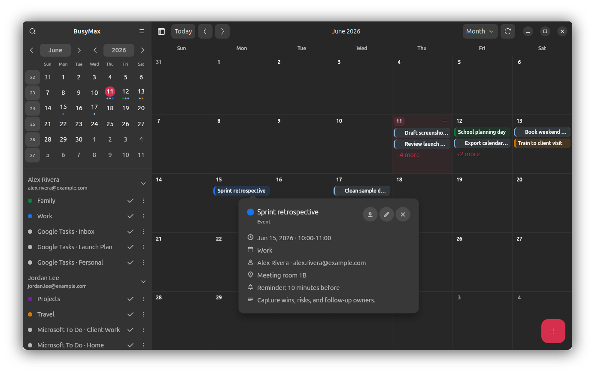
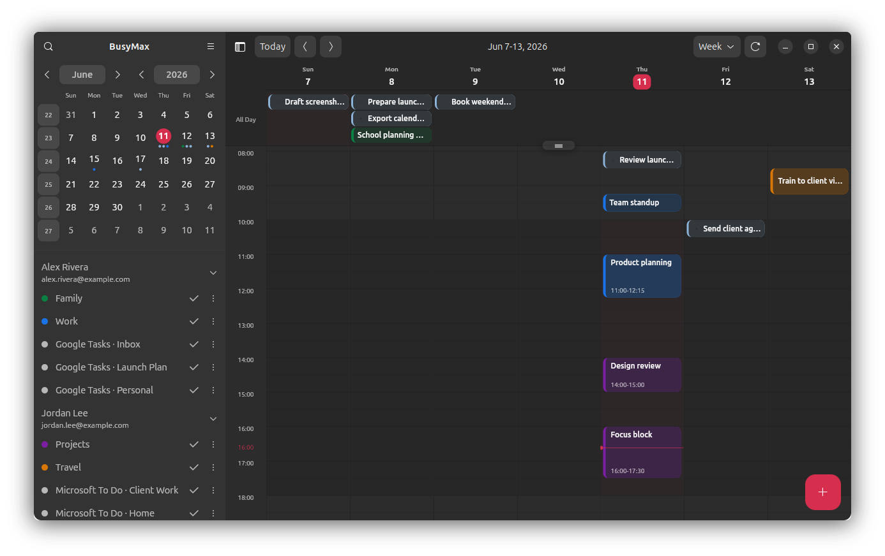
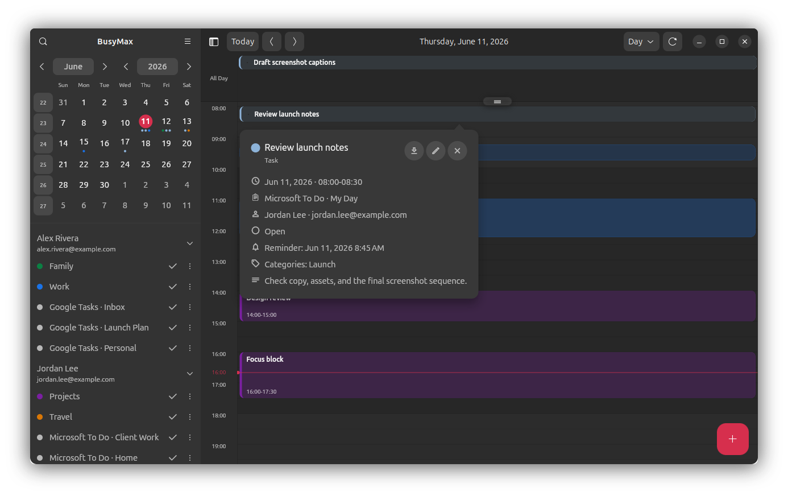
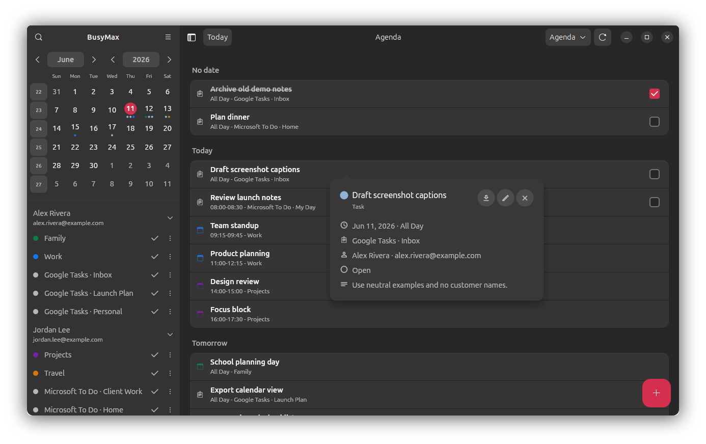
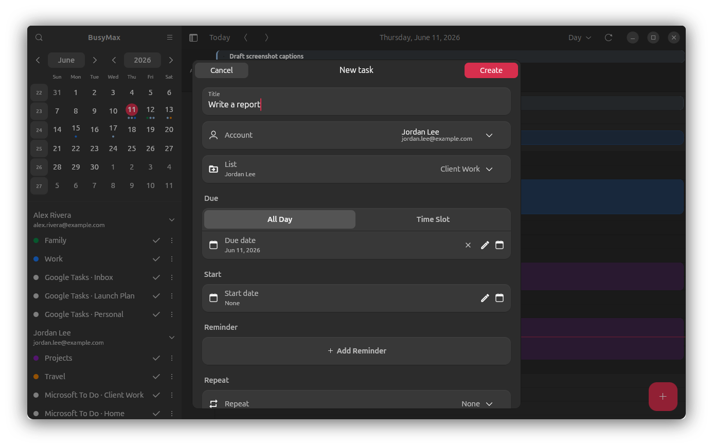
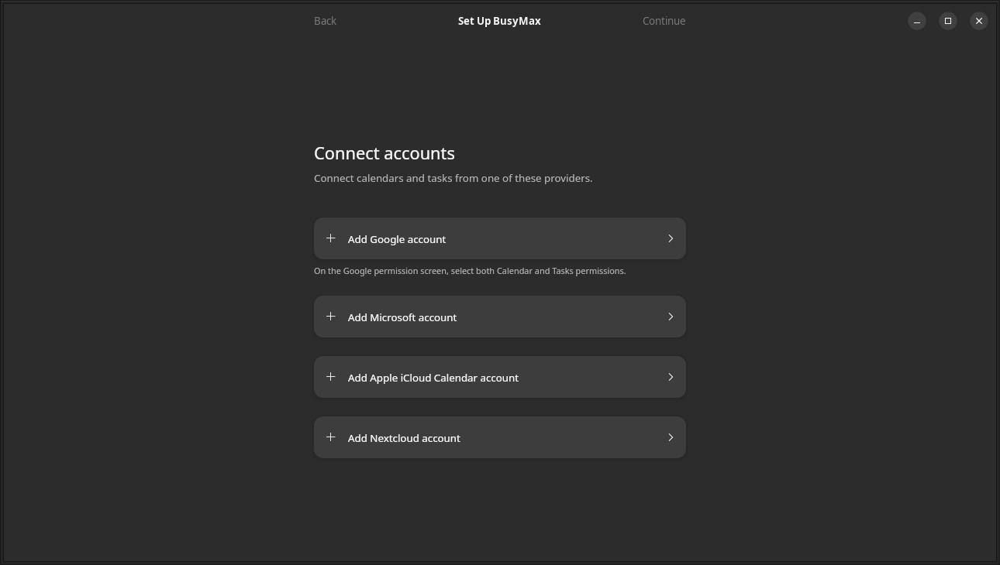
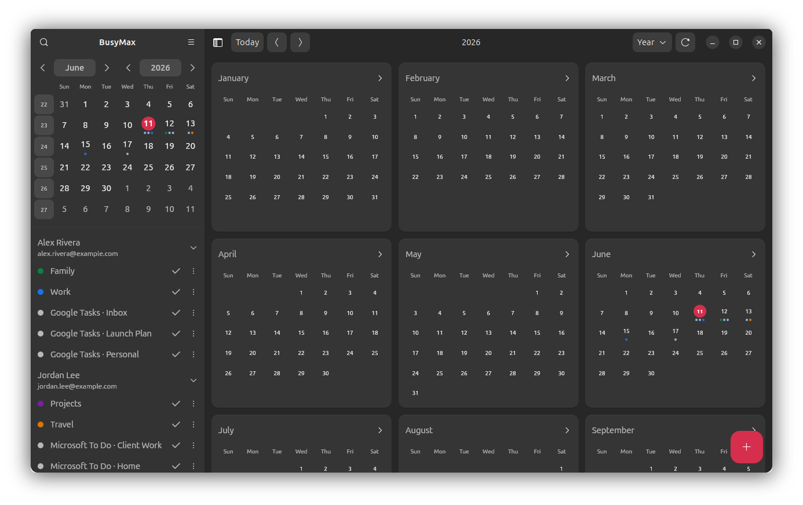
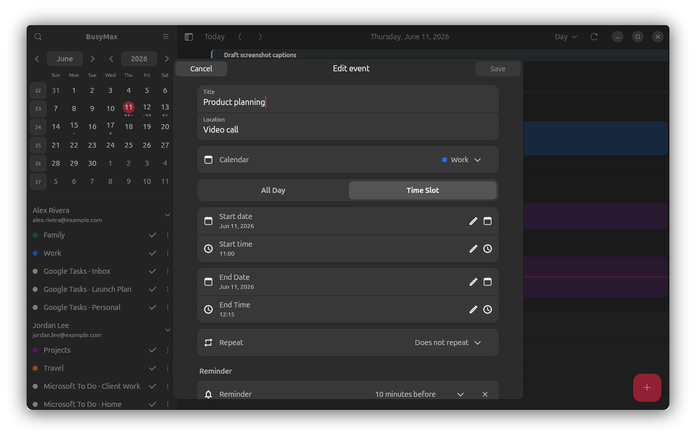

# BusyMax

BusyMax is a Linux desktop calendar and task manager built with Flutter.

It brings calendar events and tasks into a native-feeling Linux desktop
interface. BusyMax connects directly to Google, Microsoft, Apple iCloud
Calendar, and Nextcloud. Apple Reminders is not supported.

[](https://snapcraft.io/busymax)

[](https://snapcraft.io/busymax)

<p align="center">
  
</p>

<p align="center">
  <sub>Month view with calendars, tasks, and event details.</sub>
</p>

## Highlights

- Linux desktop app built with Flutter.
- Calendar views for day, week, month, year, and agenda planning.
- Task creation with lists, start/due dates, reminders, repeat options,
  subtasks, status, progress, priority, categories, location, and URL.
- Nextcloud task-list creation/rename/delete, recursive task duplicate/delete,
  raw iCalendar export, clear-completed, and cross-list subtree moves.
- Event editing with calendar selection, time controls, repeat rules, and
  reminders.
- Tray shortcut for opening the main Agenda view.
- Direct integrations with Google Calendar, Google Tasks, Microsoft Calendar,
  Microsoft To Do, Apple iCloud Calendar, Nextcloud Calendar, and Nextcloud
  Tasks.
- Offline-first local cache, conditional DAV writes, recurrence exceptions,
  alarms, and explicit conflict handling for CalDAV accounts.

## Screenshots

<table>
  <tr>
    <td width="50%">
      
      <br>
      <sub><b>Week view</b> with color-coded calendars and scheduled tasks.</sub>
    </td>
    <td width="50%">
      
      <br>
      <sub><b>Day view</b> for focused daily planning.</sub>
    </td>
  </tr>
  <tr>
    <td width="50%">
      
      <br>
      <sub><b>Agenda view</b> with upcoming events, tasks, and details.</sub>
    </td>
    <td width="50%">
      
      <br>
      <sub><b>Task creation</b> with lists, due dates, reminders, and repeat options.</sub>
    </td>
  </tr>
</table>

<details>
<summary>More screenshots</summary>

<br>

<p>
  
</p>

<p>
  
</p>

<p>
  
</p>

</details>

## Prerequisites

- [Flutter SDK](https://docs.flutter.dev/install)
- GTK 3 and libhandy development packages (`libgtk-3-dev` and
  `libhandy-1-dev` on Ubuntu/Debian)
- `GOOGLE_OAUTH_CLIENT_ID` and `GOOGLE_OAUTH_CLIENT_SECRET`; see
  [Google setup](docs/google_setup.md)
- `MICROSOFT_OAUTH_CLIENT_ID`, see [Microsoft Setup](docs/microsoft_setup.md)

Apple and Nextcloud do not require compile-time client credentials:

- [Apple iCloud Calendar setup](docs/apple_icloud_setup.md) requires two-factor
  authentication and an Apple app-specific password.
- [Nextcloud setup](docs/nextcloud_setup.md) requires an HTTPS server and
  completes authorization in the default browser.

## Run locally

Register the development launcher once so GNOME can associate BusyMax's native
Wayland windows with its desktop icon. The helper is idempotent and defaults to
the Flutter debug bundle:

```bash
tools/install_linux_dev_desktop.sh
```

Then run BusyMax normally:

```bash
flutter run -d linux \
  --dart-define=GOOGLE_OAUTH_CLIENT_ID=<google-client-id> \
  --dart-define=GOOGLE_OAUTH_CLIENT_SECRET=<google-secret-if-needed> \
  --dart-define=MICROSOFT_OAUTH_CLIENT_ID=<microsoft-client-id>
```

Use `tools/install_linux_dev_desktop.sh --uninstall` to remove the development
launcher. Remove it before testing an installed Snap so the user-level launcher
does not take precedence; packaged Snaps register their own launcher.

## Feedback submissions

The native **Send feedback** form in the About dialog sends JSON to
`POST https://busystack.org/api/feedback`. Every submission contains a new
submission UUID, the application identifier `busymax`, the application version
and build number, the `linux` platform identifier, category, subject, message,
and optional reply email. A successful response has this form:

```json
{ "id": "server-reference-id" }
```

The optional technical-details checkbox is off by default. When the user
explicitly enables it, BusyMax adds only the Linux operating-system version and
application locale. BusyMax does not attach logs, account or calendar data,
file names, screenshots, environment variables, or other diagnostics.

For local website development, override the endpoint through the existing
compile-time configuration mechanism:

```bash
flutter run -d linux \
  --dart-define=BUSYSTACK_FEEDBACK_ENDPOINT=http://127.0.0.1:8090/api/feedback
```

The local Snap helper accepts the same value with
`--dart-define BUSYSTACK_FEEDBACK_ENDPOINT=http://127.0.0.1:8090/api/feedback`.
No API, CAPTCHA, or other private server credential is used by the desktop
application.

## Provider support

The [provider capability matrix](docs/provider_support_matrix.md) lists the
features and limitations of each integration. Maintainers can use the
[live-provider test guide](docs/live_provider_testing.md) for opt-in Nextcloud
and iCloud integration tests.

## Build and publish the Snap

See [Snap Build and Beta Release](docs/beta_snap_release.md) for OAuth build
configuration, canonical Snapcraft packaging, local installation, artifact
verification, Store review, and beta release instructions.
